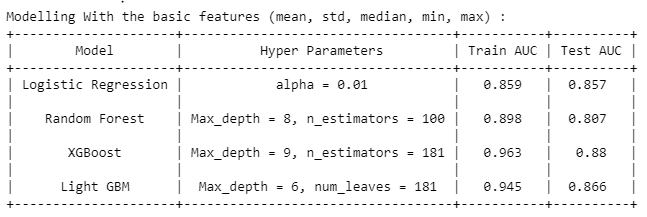
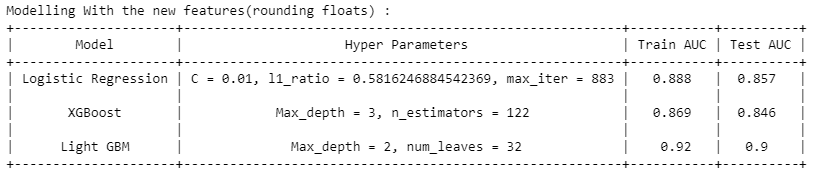

# CustomerTransactionPrediction
Identifying whether if a customer in a bank will make a specific transaction or not in the future, irrespective of the amount of money transacted given 200 numerical features. Includes EDA, new features and modelling.

